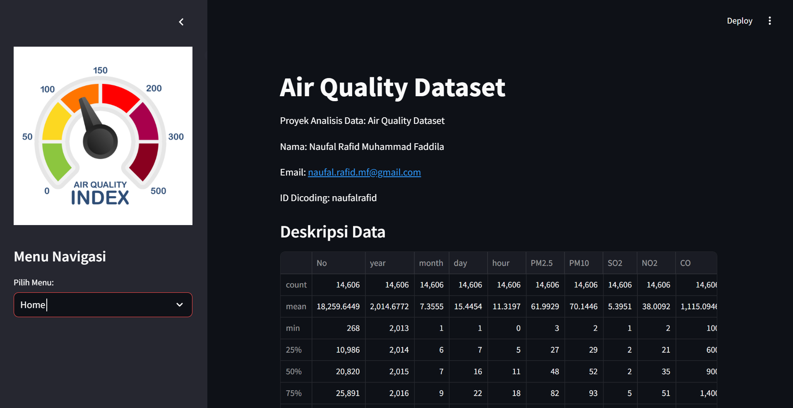

# Belajar Analisis Data dengan Python

## Dataset: Air Quality

[Air Quality Dataset](https://github.com/marceloreis/HTI/tree/master)

## Streamlit Cloud :

Streamlit Cloud : (https://dicoding-airquality-naufal-rafid.streamlit.app/)



## Setup environment

- Install Visual Studio Code for Editor
- Execute this command on command line ( as administrator prefered)

```
pip install numpy pandas scipy matplotlib seaborn jupyter
```

## Project installation

The steps to create your virtual environment from this project is as follows:

1. Clone this repository

   ```
   git clone https://github.com/NaufalR12/dicoding-airquality.git
   ```

2. Move to directory dicoding-airquality/
   ```
   cd dicoding-airquality
   ```
3. Run streamlit app
   ```
   streamlit run dashboard.py
   ```
4. Stop the application program by `ctrl + c`.

**Thank youuu!!**
